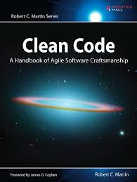
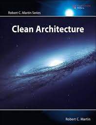
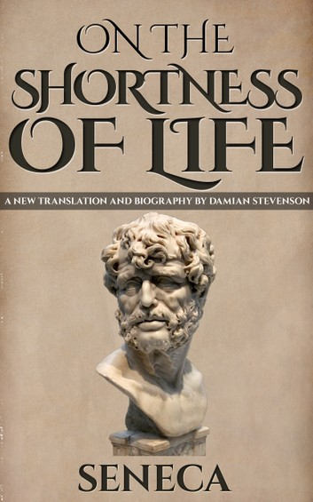
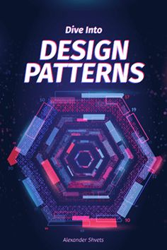

# Tech mindset 
Clean code  

Clean Coder 

Clean Architecture 

# Growth
Ego is your enemy 
Deep work 

Rework 

The economy reconstruction 
The art of thinking clearly 
Atomic habits 
Analyze people 
Subtle art 
The monk 

# Stoic 
Meditaions

The shortness of life 

# Religious 
Because you areAllah 

# Tech 
mark richards  
Dive in Design patterns  

Solid gang of four 

# Politics and history 
The unfinished presedency JFK 

