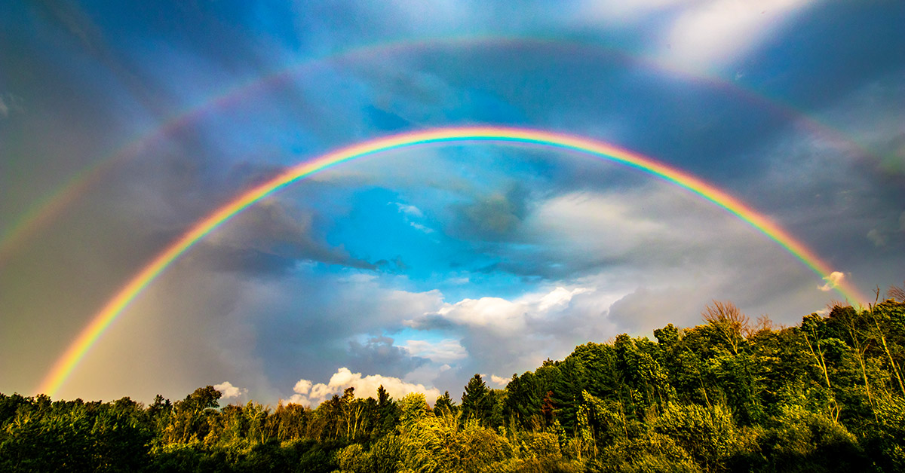

اراء الناس في موضوع واحد بتختلف حتى لو عاشوا نفس الظروف و الزمن. لهيك كثير منسمع شخص بحكي عن شخص ثاني انه ما بطيقه ممكن السبب ما في كيميا بينهم او ممكن ما تعارض مصالح اراء توجهات 
 لكن لما تحكي عن التجربة الدراسية عندك اكثر من مليون واحد بالاردن متعلم بالجامعة و 10 مليون راح المدرسة و رح يعطي رأيه بناءا على تجربته اللي بالغالب لا ما بتصور الحقيقة 
رح استعرض اكثر التجارب تكرارا اللي اما شفت ناس مرت فيها او انت مريت فيها او مريت بتجارب قريبة منها  

> ## فئة احلى ايام حياتهم

هم اللي بشتاقوا بس يتخرجوا و دايما هاي الفترة بتكون اول شي بحكوا عنه لما يكونوا بنقاشات الماضي و في كثير اسباب لحبهم لهاي الفترة اما مروا بتجارب تتطوروا منها او تعرفوا على ناس كان الهم أثر عاطفي او صداقة خلت التجربة الجامعة تمد للأبد ممكن بكونوا يكذبوا على حالهم عشان مروا بعد هيك بظروف صعبة فتذكروا ايام الماضي على انها طريقة لينسوا الحاضر

> ## فئة البائسين

فئة مرت بمشاكل بالجامعة اما ظروف حكمت عليهم او مواقف و مشاكل ممكن التخصص او دكتور نكد عليهم 

أغلب الناس رح تلاقيها بين النوعين بين حزن و حنين لكن احنا هون مش رح نناقش الأمور اللي ممكن تختلف من تجربة شخص لأخر
> رح نناقش الأمور اللي مهما كان موقفك و تجربتك و توجهاتك رح تكون مريت فيها

ما بتستغربوا لما تلاقوا الأكاديميين بوطنك وين ما كنت ببلاد العرب و هم بحكوا بطريقة انه التعليم عندهم مهم و هم مركز الكون و بذكر اسم بلده بنقاشه كثير كثير بلدي ام الدنيا بلدي اقوى تعليم بس بنفس الوقت روح على تصنيف العالمي بتلاقي تعليم بلده في مؤخرة العالم 
و نفسهم الأكاديميين رح يحكوا انه سبب تأخر التعليم هو انه الجيل جديد مش مهتم بالدراسة مع دفاع مستميت عن المنظومة  
للأسف اغلب الشباب و البنات مصدقيين هلحكي و لما حد منهم ما يزبط بمادة معينة الدكتور بهول الأمور على انه كيف بدك تنجح بحياتك و تدخل الجنة و انت مش ناجح عندي  
بس كلنا عارفين انه الغلط هو اللي بعلمك و الصعوبات هي اللي بتبني شخصيتك مش ايام الفراغ  
طيب ليه المنظومة قمعية؟  
> في تعليم وفي تعليم بالوطن العربي و هم موضوعين بعاد عن بعض موضوعنا هو الثاني تحديدا 

قبل لنكمل حاب تفكر شو تعريفك للمنظومة التعليمية اللي انت مريت فيها فكر بالسؤال من كل جوانبه و بعدين انزل تحت رح يكون رأيي 
 
 
 
 
 
 
 
 
 
 
 
 
 
 
 
 
 
 
 
 
 
 
 
 
 
 
 
 
 
 

> ## هي مرحلة غسيل دماغ 

لا تنحبط.. لسا
